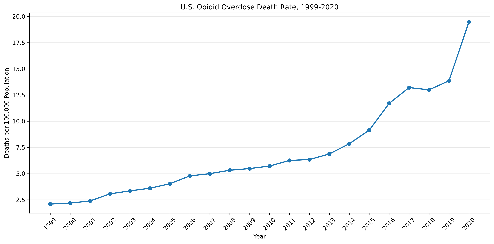
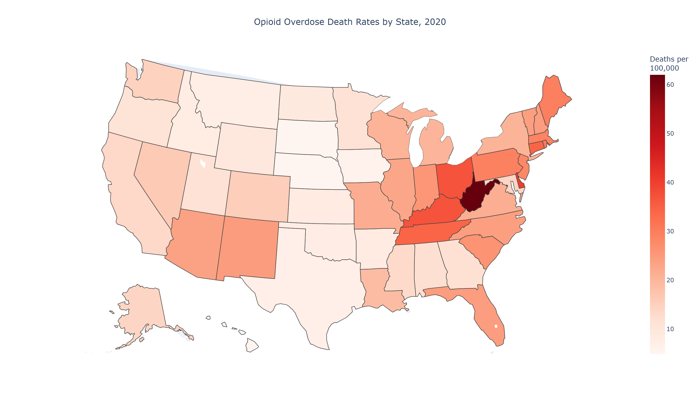
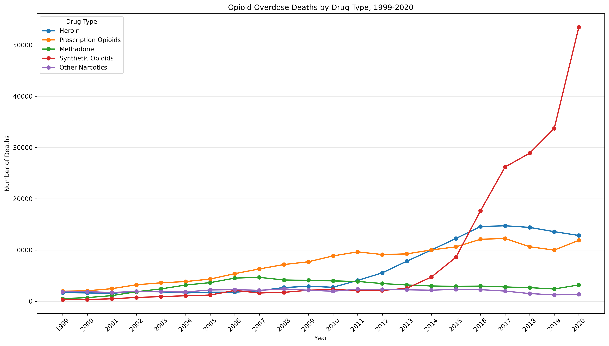
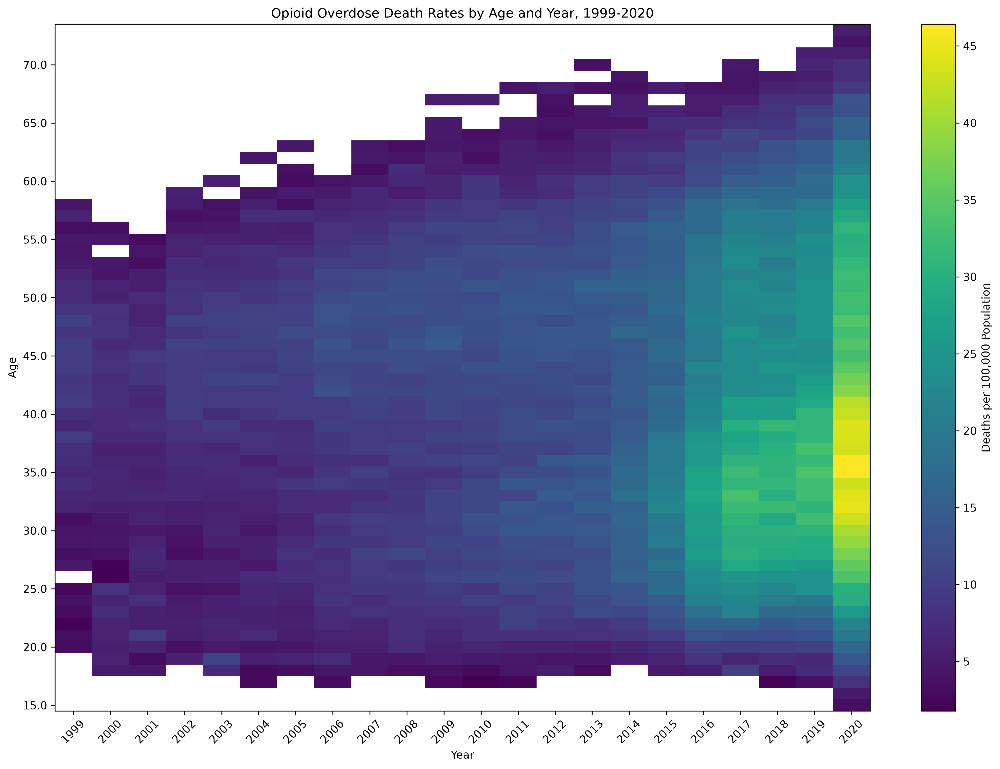

# Understanding the Opioid Crisis
## An Analysis of U.S. Opioid Overdose Trends Using CDC WONDER Data


---

## Project Overview

The opioid epidemic continues to be one of the most significant public health challenges in the United States. This project analyzes national opioid overdose mortality trends using publicly available data from the CDC WONDER Multiple Cause of Death database.

The goal of this project is to identify geographic and demographic patterns in opioid overdose deaths, examine how different opioid categories have changed over time, and evaluate whether historical trends can be used to predict future overdose death rates using machine learning models.

This project was completed as the capstone project for the Master of Science in Data Analytics program at Northwest Missouri State University.

---

## Objectives

- Analyze national opioid overdose trends from **1999–2020**
- Examine differences across U.S. states
- Explore demographic trends by:
  - Age
  - Sex
  - Race/Ethnicity
- Compare overdose trends across opioid categories:
  - Heroin
  - Prescription opioids
  - Methadone
  - Synthetic opioids
  - Other narcotics
- Build predictive models to estimate opioid overdose death rates

---

## Key Results

- Analyzed over 20 years of U.S. opioid overdose mortality data.
- Combined nine CDC WONDER datasets into one analytical dataset.
- Identified major demographic and geographic trends.
- Compared multiple machine learning models.
- Linear Regression achieved the strongest predictive performance (R² ≈ 0.83).

---

## Data Source

**CDC WONDER Multiple Cause of Death Database**

Years Included:

- 1999–2020

Primary datasets include:

- Opioid overdose deaths by state and year
- Opioid deaths by age
- Opioid deaths by sex
- Opioid deaths by race/ethnicity

Additional drug-specific datasets:

- Heroin
- Prescription opioids
- Methadone
- Synthetic opioids
- Other narcotics

---

## Project Workflow

```text
CDC WONDER
        │
        ▼
Data Cleaning & Validation
        │
        ▼
Merge Drug-Specific Datasets
        │
        ▼
Exploratory Data Analysis
        │
        ▼
Visualization
        │
        ▼
Predictive Modeling
        │
        ▼
Interpretation & Conclusions
```

---

# Repository Structure

```text
opioid-overdose-capstone/
│
├── data/
│   ├── raw/
│   └── processed/
│
├── figures/
│
├── notebooks/
│   ├── eda.ipynb
│   └── predictive_modeling.ipynb
│
├── reports/
│
├── src/
│   └── data_processing/
│
├── README.md
├── pyproject.toml
└── uv.lock
```

The preprocessing pipeline is implemented as reusable Python scripts in src/data_processing/. Exploratory data analysis, visualization, and predictive modeling were performed in Jupyter notebooks to support an interactive analytical workflow.

---

# Exploratory Data Analysis

## National Opioid Death Rate

The national opioid overdose death rate increased dramatically between 1999 and 2020, with especially rapid growth occurring after 2013.

<p align="center">

</p>

---

## Geographic Distribution

States in Appalachia, the Ohio Valley, and portions of the Northeast experienced the highest opioid overdose death rates in 2020.

<p align="center">

</p>

---

## Drug Category Trends

Different opioid categories followed distinct patterns over time. Synthetic opioids showed the most dramatic increase during the final years of the study period.

<p align="center">

</p>

---

## Demographic Trends

The project also examined overdose mortality by age, sex, and race/ethnicity to identify populations experiencing the greatest increases over time.

<p align="center">

</p>

---

# Predictive Modeling

Three regression models were evaluated for predicting opioid overdose death rates.

| Model | Purpose |
|--------|----------|
| Linear Regression | Baseline predictive model |
| Random Forest | Ensemble tree model |
| Gradient Boosting | Boosted decision tree model |

Model performance was compared using:

- MAE
- RMSE
- R²

Linear Regression produced the strongest overall performance on this dataset.

---

# Technologies Used

- Python
- Pandas
- NumPy
- Plotly
- Matplotlib
- Scikit-learn
- Jupyter Notebook
- CDC WONDER

---

# Reproducing the Project
<details> <summary><strong>Reproducing the Project</strong></summary>

<br>

The following instructions explain how to clone the repository, create the Python environment, select the correct Jupyter kernel, run the preprocessing scripts, and open the analysis notebooks.

## Prerequisites
Before beginning, make sure the following programs are installed:
- Git
- Python
- uv
- Visual Studio Code with the Python and Jupyter extensions, or JupyterLab

To confirm that Git and uv are installed, open a terminal and run:

```bash
git --version
uv --version
```

If both commands return version numbers, the required tools are available.

## 1. Clone the Repository

Open PowerShell, Windows Terminal, or another terminal and navigate to the folder where you want to store the project.

Clone the GitHub repository:

git clone https://github.com/abeaderstadt/opioid-overdose-capstone.git

Move into the project directory:

cd opioid-overdose-capstone

## 2. Create the Python Environment

This project uses uv to manage Python and project dependencies.

Install the required Python version listed in the project configuration:

```bash
uv python install
```

Create the virtual environment and install all project dependencies:

```bash
uv sync
```

This command creates a local .venv folder and installs the packages listed in pyproject.toml and uv.lock.

To confirm that the environment was created successfully, run:
```bash
uv run python --version
```

You can also confirm that the required packages are installed by running:

```bash
uv pip list
```

## 3. Open the Project in Visual Studio Code

From the project directory, launch Visual Studio Code:

code .

If the code command is unavailable, open Visual Studio Code manually and select:

File → Open Folder

Then choose the opioid-overdose-capstone folder.

## 4. Select the Python Interpreter

In Visual Studio Code:

Open the Command Palette by pressing Ctrl+Shift+P.
Search for:
Python: Select Interpreter
Select the Python interpreter located inside the project's .venv folder.

On Windows, it will usually look similar to:

.venv\Scripts\python.exe

After selecting the interpreter, Visual Studio Code should use the project's virtual environment when running Python files.

## 5. Select the Jupyter Kernel

Open one of the notebooks in the notebooks folder:

notebooks/eda.ipynb

or:

notebooks/predictive_modeling.ipynb

In the upper-right corner of the notebook, click Select Kernel.

Choose:

Python Environments

Then select the interpreter from the project's `.venv` folder.

On Windows, the selected kernel should point to something similar to:

.venv\Scripts\python.exe

If the environment does not appear in the kernel list:

1. Open the Command Palette with `Ctrl+Shift+P`.
2. Select:
Developer: Reload Window
3. Reopen the notebook and select the kernel again.

You can verify that the correct kernel is active by running the following code in a notebook cell:

import sys

print(sys.executable)

The output should include the project directory and `.venv`.

## 6. Confirm the Data Files

The repository contains separate folders for raw and processed data:

data/
├── raw/
└── processed/

The preprocessing scripts read the original CDC WONDER datasets from data/raw/ and save cleaned datasets to data/processed/.

Before running the preprocessing workflow, confirm that the required raw CSV files are present in the data/raw/ folder.

## 7. Run the Data-Processing Scripts

The preprocessing scripts are stored in:

src/data_processing/

Run the scripts from the root of the repository so that all relative file paths work correctly.

For example:

uv run python src/data_processing/01_build_opioid_master_dataset.py

Run any additional preprocessing scripts in their numbered order. For example:

uv run python src/data_processing/02_clean_age_dataset.py
uv run python src/data_processing/03_clean_sex_dataset.py
uv run python src/data_processing/04_clean_race_dataset.py

Use the exact filenames shown in the src/data_processing/ folder if they differ from these examples.

The scripts will clean and transform the raw CDC WONDER files and save the resulting datasets to:

data/processed/

After running the scripts, review the terminal output for validation messages, dataset dimensions, missing-value summaries, or errors.

## 8. Launch JupyterLab

JupyterLab can be launched from the project directory with:
```bash
uv run jupyter lab
```
This command will open JupyterLab in a web browser.

Navigate to the `notebooks` folder and open:

eda.ipynb

Run this notebook first because it contains the exploratory analysis and visualizations.

Then open:

predictive_modeling.ipynb

This notebook contains the feature preparation, model training, model evaluation, and comparison of Linear Regression, Random Forest, and Gradient Boosting.

## 9. Run the Notebooks

To reproduce all notebook outputs, select:

Run → Run All Cells

Run the notebooks in the following order:

1. notebooks/eda.ipynb
2. notebooks/predictive_modeling.ipynb

Make sure the project's .venv kernel remains selected before running the cells.

The notebooks read the cleaned datasets from:

data/processed/

Some notebook cells may save charts or other visual outputs to:

figures/

## 10. Run Jupyter Notebook from Visual Studio Code

The notebooks can also be run directly inside Visual Studio Code.

After opening a notebook and selecting the `.venv` kernel:

1. Click Run All near the top of the notebook.
2. Allow each cell to finish before reviewing the output.
3. Confirm that no cells display errors.
4. Save the notebook after the outputs have been generated.

The kernel name shown in the upper-right corner should correspond to the project's `.venv` environment.

## 11. Stop JupyterLab

When finished, return to the terminal where JupyterLab is running.

Press:

Ctrl+C

If prompted to confirm shutdown, enter:

y

and press Enter.

## Troubleshooting
The uv command is not recognized

Install uv, close the terminal, open a new terminal, and run:

uv --version
The virtual environment does not appear in Visual Studio Code

Run:

uv sync

Then reload Visual Studio Code:

Ctrl+Shift+P → Developer: Reload Window

After reloading, select the interpreter again.

The notebook cannot find a package

Confirm that the correct kernel is selected and run:

uv sync

Then restart the notebook kernel.

The notebook cannot find a data file

Make sure the notebook is being run from the cloned repository and that the required files exist in:

data/raw/

and:

data/processed/

Run the preprocessing scripts before running the notebooks.

File paths fail when running a script

Run all commands from the repository root:

cd opioid-overdose-capstone

Then run the script using its full relative path:

uv run python src/data_processing/<script_name>.py

## Command Summary
git clone https://github.com/abeaderstadt/opioid-overdose-capstone.git
cd opioid-overdose-capstone

uv python install
uv sync

uv run python src/data_processing/01_build_opioid_master_dataset.py

uv run jupyter lab

After JupyterLab opens, run the notebooks in this order:

notebooks/eda.ipynb
notebooks/predictive_modeling.ipynb

</details>
---

# Key Findings

- Opioid overdose mortality increased substantially between 1999 and 2020.
- Synthetic opioids became the dominant driver of overdose deaths during the later years of the study period.
- Geographic differences revealed particularly high mortality rates in several eastern states.
- Clear demographic differences were observed across age, sex, and race/ethnicity.
- Linear Regression provided the best predictive performance among the evaluated models.

---

# Future Work

Potential future improvements include:

- Incorporating socioeconomic indicators
- Adding county-level analyses
- Forecasting future overdose mortality beyond 2020
- Exploring additional machine learning models
- Building an interactive dashboard

---

# Author

**Alissa Beaderstadt**

M.S. Data Analytics
Northwest Missouri State University

GitHub:

https://github.com/abeaderstadt

---

## License

This project is provided for educational and research purposes.
